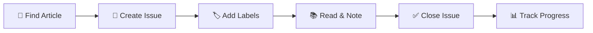

# 📰 Newsletter Tracker

A personal knowledge management system leveraging GitHub's native features to organize, track, and annotate articles from newsletters and other sources.

## 🎯 Purpose
- 📝 Store important articles for later reading
- 🗂️ Organize content by categories and sources
- 📊 Track reading progress with GitHub Issues
- 💭 Add personal notes and insights over time
- 🔍 Powerful search across all saved content
- 📱 Access from any device via GitHub mobile

## 📊 Command Center

### 📈 Reading Statistics
| Metric | Count | Quick Access |
|--------|-------|--------------|
| **Total Articles** | [](../../issues) | [All Articles](../../issues) |
| **To Read** | [](../../issues?q=is%3Aissue+is%3Aopen+label%3A%22to-read%22) | [Reading Queue](../../issues?q=is%3Aissue+is%3Aopen+label%3A%22to-read%22) |
| **In Progress** | [](../../issues?q=is%3Aissue+is%3Aopen+label%3Areading) | [Currently Reading](../../issues?q=is%3Aissue+is%3Aopen+label%3Areading) |
| **Completed** | [](../../issues?q=is%3Aissue+is%3Aclosed) | [Finished Reading](../../issues?q=is%3Aissue+is%3Aclosed) |

### 🏷️ Content Categories
| Category | Description | Articles |
|----------|-------------|----------|
| [🔧 **Technology**](../../issues?q=is%3Aissue+label%3Atech) | AI, programming, software trends | [](../../issues?q=is%3Aissue+label%3Atech) |
| [💼 **Business**](../../issues?q=is%3Aissue+label%3Abusiness) | Startups, finance, entrepreneurship | [](../../issues?q=is%3Aissue+label%3Abusiness) |
| [📚 **Personal Dev**](../../issues?q=is%3Aissue+label%3Apersonal) | Skills, productivity, learning | [](../../issues?q=is%3Aissue+label%3Apersonal) |
| [🌍 **Industry**](../../issues?q=is%3Aissue+label%3Aindustry) | Market trends, industry analysis | [](../../issues?q=is%3Aissue+label%3Aindustry) |
| [🎯 **High Priority**](../../issues?q=is%3Aissue+label%3Ahigh-priority) | Must-read articles | [](../../issues?q=is%3Aissue+label%3Ahigh-priority) |

### 📮 Newsletter Sources
| Source | Focus | Articles |
|--------|-------|----------|
| [📧 **Morning Brew**](../../issues?q=is%3Aissue+label%3A%22morning-brew%22) | Business news digest | [](../../issues?q=is%3Aissue+label%3A%22morning-brew%22) |
| [🚀 **Hacker News**](../../issues?q=is%3Aissue+label%3A%22hacker-news%22) | Tech community discussions | [](../../issues?q=is%3Aissue+label%3A%22hacker-news%22) |
| [💡 **Medium**](../../issues?q=is%3Aissue+label%3Amedium) | In-depth articles | [](../../issues?q=is%3Aissue+label%3Amedium) |
| [🤖 **AI Newsletter**](../../issues?q=is%3Aissue+label%3A%22ai-newsletter%22) | AI/ML developments | [](../../issues?q=is%3Aissue+label%3A%22ai-newsletter%22) |
| [📈 **The Hustle**](../../issues?q=is%3Aissue+label%3A%22the-hustle%22) | Business and trends | [](../../issues?q=is%3Aissue+label%3A%22the-hustle%22) |

## 🚀 Quick Actions

<div align="center">

[](../../issues/new/choose)
[](https://github.com/mobile)
[](../../search?q=&type=issues)

</div>

### 📖 Reading Workflow


1. **📰 Discover:** Find interesting article in newsletter
2. **📝 Capture:** Create GitHub issue with article details
3. **🏷️ Organize:** Add category and source labels
4. **📚 Read:** Read article and add notes as comments
5. **✅ Complete:** Close issue when finished
6. **📊 Review:** Use dashboard to track reading habits

### 🎯 Quick Filters

| Filter | Description | Link |
|--------|-------------|------|
| **🔥 This Week** | Recent articles | [View](../../issues?q=is%3Aissue+created%3A%3E%3D$(date -d '7 days ago' +%Y-%m-%d)) |
| **⭐ Starred** | Favorited articles | [View](../../issues?q=is%3Aissue+label%3Astarred) |
| **📝 With Notes** | Articles with comments | [View](../../issues?q=is%3Aissue+comments%3A%3E0) |
| **⚡ Quick Reads** | Short articles (<5 min) | [View](../../issues?q=is%3Aissue+label%3Aquick-read) |
| **📖 Long Reads** | In-depth articles | [View](../../issues?q=is%3Aissue+label%3Along-read) |

## 📱 Mobile & Cross-Platform Access

### GitHub Mobile App
- 📱 **Quick Capture:** Create issues on-the-go
- 🔍 **Search:** Find articles anywhere
- 💬 **Comment:** Add thoughts while reading
- 🔔 **Notifications:** Stay updated on new articles

### Browser Bookmarks
Save these quick-access links:
- [📋 Dashboard](https://github.com/sadrzadehsina/newsletter-tracker)
- [➕ Add Article](https://github.com/sadrzadehsina/newsletter-tracker/issues/new/choose)
- [📚 Reading Queue](https://github.com/sadrzadehsina/newsletter-tracker/issues?q=is%3Aissue+is%3Aopen+label%3A%22to-read%22)
- [🔍 Search](https://github.com/sadrzadehsina/newsletter-tracker/search?q=&type=issues)

## 🔍 Advanced Search Techniques

### GitHub Search Syntax
```bash
# Search by label combination
is:issue label:tech label:high-priority

# Search in title and body
"machine learning" in:title
"productivity tips" in:body

# Search by date range
created:2024-01-01..2024-12-31

# Search by author or commenter
author:@me
commenter:@me

# Combine filters
is:open label:tech created:>2024-01-01 "AI"
```

### Saved Searches
| Search | Query | Description |
|--------|-------|-------------|
| **Priority Queue** | `is:open label:high-priority` | Most important unread articles |
| **Weekly Review** | `is:closed updated:>$(date -d '7 days ago' +%Y-%m-%d)` | Recently completed reading |
| **Research Topics** | `is:open label:research` | Articles for deeper investigation |
| **Action Items** | `is:open "TODO" OR "action item"` | Articles with follow-ups |

## 🤖 Automation & Integration

### GitHub Actions Available
- 📊 **Weekly Summary:** Auto-generate reading stats
- 🏷️ **Smart Labeling:** Auto-categorize articles by content
- 📧 **Email Digest:** Weekly summary of saved articles
- 📱 **Mobile Shortcuts:** iOS/Android integration

### Browser Extensions
- 🔖 **Save to GitHub:** One-click article saving
- 🏷️ **Auto-labeling:** Smart category detection
- 📝 **Quick Notes:** Add thoughts while reading

---

## 📚 Resources

- 📖 [How to Use Guide](docs/how-to-use.md)
- 📝 [Article Templates](templates/)
- 🤖 [Automation Scripts](.github/workflows/)
- 💡 [Tips & Tricks](docs/tips-and-tricks.md)

---

<div align="center">

**💡 Pro Tip:** Use GitHub's mobile app for quick article saving during your morning newsletter reading!

*Last updated: September 22, 2025*
*Repository: [newsletter-tracker](https://github.com/sadrzadehsina/newsletter-tracker)*

</div>